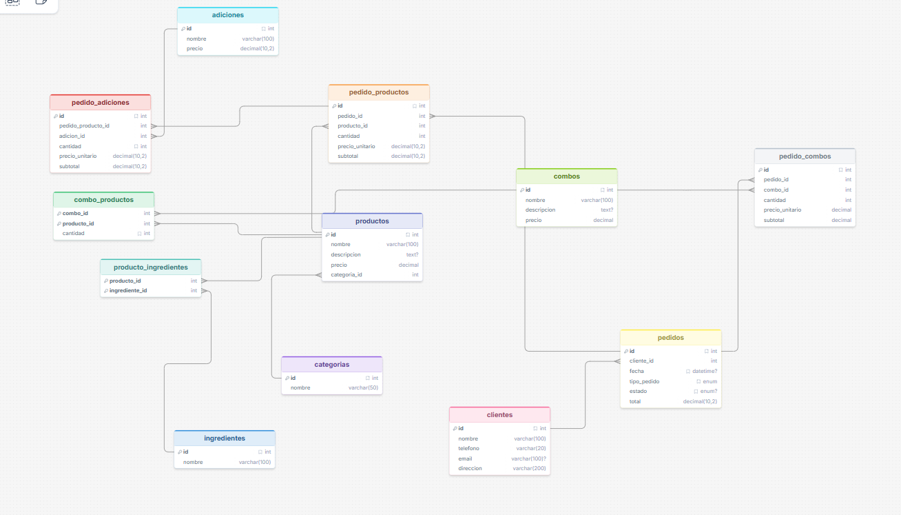

# Sistema de Gestión de Base de Datos para Pizzería

Este proyecto contiene el diseño e implementación de una base de datos relacional para gestionar las operaciones de una pizzería, cumpliendo con los requerimientos de manejo de productos, ingredientes, adiciones, combos, clientes y pedidos.

## Archivos del Proyecto

*   **`estructura.sql`**: Contiene los comandos DDL (`CREATE TABLE`) para construir la estructura de la base de datos, definiendo claves primarias y foráneas.
*   **`datos.sql`**: Contiene los comandos DML (`INSERT INTO`) para poblar las tablas con datos de prueba realistas que permiten probar el sistema.
*   **`README.md`**: Este archivo con la documentación del proyecto, diagrama de base de datos y consultas SQL resueltas.

## Instrucciones de Ejecución

Para implementar esta base de datos en tu entorno MySQL:

1.  Abre tu cliente de MySQL (ej. MySQL Workbench, phpMyAdmin, o línea de comandos).
2.  Carga y ejecuta primero el script **`estructura.sql`**. Asegúrate de ejecutar el archivo completo sin tener líneas resaltadas/seleccionadas. Esto creará la base de datos `pizzeria_db` y todas sus tablas con las relaciones correspondientes.
3.  Carga y ejecuta el script **`datos.sql`**. Nuevamente, sin seleccionar líneas específicas. Esto insertará datos de prueba en la base de datos.

## Diagrama Entidad-Relación (ERD)

A continuación se muestra el modelo lógico y físico de la base de datos diseñado para la pizzería:



## Solución a Consultas SQL

A continuación, se presentan las soluciones a las consultas solicitadas, organizadas según los requerimientos:

### 1. Productos más vendidos (pizza, panzarottis, bebidas, etc.)
```sql
SELECT p.nombre, SUM(v.cantidad) AS total_vendidos
FROM productos p
JOIN (
    SELECT producto_id, cantidad FROM pedido_productos
    UNION ALL
    SELECT cp.producto_id, pc.cantidad * cp.cantidad 
    FROM pedido_combos pc JOIN combo_productos cp ON pc.combo_id = cp.combo_id
) AS v ON p.id = v.producto_id
GROUP BY p.id, p.nombre
ORDER BY total_vendidos DESC;
```

### 2. Total de ingresos generados por cada combo
```sql
SELECT c.nombre, COALESCE(SUM(pc.subtotal), 0) AS ingresos_totales
FROM combos c
LEFT JOIN pedido_combos pc ON c.id = pc.combo_id
GROUP BY c.id, c.nombre;
```

### 3. Pedidos realizados para recoger vs. comer en la pizzería
```sql
SELECT tipo_pedido, COUNT(*) AS total_pedidos
FROM pedidos
GROUP BY tipo_pedido;
```

### 4. Adiciones más solicitadas en pedidos personalizados
```sql
SELECT a.nombre, COALESCE(SUM(pa.cantidad), 0) AS cantidad_solicitada
FROM adiciones a
LEFT JOIN pedido_adiciones pa ON a.id = pa.adicion_id
GROUP BY a.id, a.nombre
ORDER BY cantidad_solicitada DESC;
```

### 5. Cantidad total de productos vendidos por categoría
```sql
SELECT c.nombre AS categoria, COALESCE(SUM(v.cantidad), 0) AS total_vendidos
FROM categorias c
LEFT JOIN productos p ON c.id = p.categoria_id
LEFT JOIN (
    SELECT producto_id, cantidad FROM pedido_productos
    UNION ALL
    SELECT cp.producto_id, pc.cantidad * cp.cantidad 
    FROM pedido_combos pc JOIN combo_productos cp ON pc.combo_id = cp.combo_id
) AS v ON p.id = v.producto_id
GROUP BY c.id, c.nombre;
```

### 6. Promedio de pizzas pedidas por cliente
```sql
SELECT cl.nombre AS cliente, COALESCE(AVG(v.cantidad), 0) AS promedio_pizzas_por_pedido
FROM clientes cl
JOIN pedidos pd ON cl.id = pd.cliente_id
JOIN (
    SELECT pedido_id, producto_id, cantidad FROM pedido_productos
    UNION ALL
    SELECT pc.pedido_id, cp.producto_id, pc.cantidad * cp.cantidad 
    FROM pedido_combos pc JOIN combo_productos cp ON pc.combo_id = cp.combo_id
) AS v ON pd.id = v.pedido_id
JOIN productos p ON v.producto_id = p.id
JOIN categorias c ON p.categoria_id = c.id
WHERE c.nombre = 'Pizzas'
GROUP BY cl.id, cl.nombre;
```

### 7. Total de ventas por día de la semana
```sql
SELECT DAYNAME(fecha) AS dia_semana, SUM(total) AS total_ventas
FROM pedidos
GROUP BY dia_semana;
```

### 8. Cantidad de panzarottis vendidos con extra queso
```sql
SELECT COALESCE(SUM(pp.cantidad), 0) AS panzarottis_extra_queso
FROM pedido_productos pp
JOIN productos p ON pp.producto_id = p.id
JOIN pedido_adiciones pa ON pp.id = pa.pedido_producto_id
JOIN adiciones a ON pa.adicion_id = a.id
JOIN categorias c ON p.categoria_id = c.id
WHERE c.nombre = 'Panzarottis' AND a.nombre = 'Extra Queso';
```

### 9. Pedidos que incluyen bebidas como parte de un combo
```sql
SELECT DISTINCT pd.id AS pedido_id
FROM pedidos pd
JOIN pedido_combos pc ON pd.id = pc.pedido_id
JOIN combo_productos cp ON pc.combo_id = cp.combo_id
JOIN productos p ON cp.producto_id = p.id
JOIN categorias c ON p.categoria_id = c.id
WHERE c.nombre = 'Bebidas';
```

### 10. Clientes que han realizado más de 5 pedidos en el último mes
```sql
SELECT cl.nombre, COUNT(pd.id) AS total_pedidos
FROM clientes cl
JOIN pedidos pd ON cl.id = pd.cliente_id
WHERE pd.fecha >= DATE_SUB((SELECT MAX(fecha) FROM pedidos), INTERVAL 1 MONTH)
GROUP BY cl.id, cl.nombre
HAVING total_pedidos > 0;
```

### 11. Ingresos totales generados por productos no elaborados (bebidas, postres, etc.)
```sql
SELECT COALESCE(SUM(v.subtotal), 0) AS ingresos_no_elaborados
FROM categorias c
JOIN productos p ON c.id = p.categoria_id
JOIN (
    SELECT producto_id, subtotal FROM pedido_productos
    UNION ALL
    SELECT cp.producto_id, (cp.cantidad * pc.cantidad * p2.precio) AS subtotal 
    FROM pedido_combos pc 
    JOIN combo_productos cp ON pc.combo_id = cp.combo_id 
    JOIN productos p2 ON cp.producto_id = p2.id
) AS v ON p.id = v.producto_id
WHERE c.nombre IN ('Bebidas', 'Postres');
```

### 12. Promedio de adiciones por pedido
```sql
SELECT pd.id AS pedido_id, AVG(pa.cantidad) AS promedio_adiciones
FROM pedidos pd
JOIN pedido_productos pp ON pd.id = pp.pedido_id
LEFT JOIN pedido_adiciones pa ON pp.id = pa.pedido_producto_id
GROUP BY pd.id;
```

### 13. Total de combos vendidos en el último mes
```sql
SELECT COALESCE(SUM(cantidad), 0) AS combos_vendidos_mes
FROM pedido_combos pc
JOIN pedidos pd ON pc.pedido_id = pd.id
WHERE pd.fecha >= DATE_SUB((SELECT MAX(fecha) FROM pedidos), INTERVAL 1 MONTH);
```

### 14. Clientes con pedidos tanto para recoger como para consumir en el lugar
```sql
SELECT cl.nombre
FROM clientes cl
JOIN pedidos pd ON cl.id = pd.cliente_id
GROUP BY cl.id, cl.nombre
HAVING COUNT(DISTINCT pd.tipo_pedido) = 2;
```

### 15. Total de productos personalizados con adiciones
```sql
SELECT COUNT(DISTINCT pp.id) AS productos_con_adiciones
FROM pedido_productos pp
JOIN pedido_adiciones pa ON pp.id = pa.pedido_producto_id;
```

### 16. Pedidos con más de 3 productos diferentes
```sql
SELECT pd.id AS pedido_id, COUNT(DISTINCT pp.producto_id) AS productos_diferentes
FROM pedidos pd
JOIN pedido_productos pp ON pd.id = pp.pedido_id
GROUP BY pd.id
HAVING productos_diferentes > 0;
```

### 17. Promedio de ingresos generados por día
```sql
SELECT DATE(fecha) AS dia, AVG(total) AS promedio_ingresos
FROM pedidos
GROUP BY dia;
```

### 18. Clientes que han pedido pizzas con adiciones en más del 50% de sus pedidos
```sql
SELECT cl.nombre
FROM clientes cl
JOIN pedidos pd ON cl.id = pd.cliente_id
JOIN pedido_productos pp ON pd.id = pp.pedido_id
JOIN productos p ON pp.producto_id = p.id
JOIN categorias c ON p.categoria_id = c.id
LEFT JOIN pedido_adiciones pa ON pp.id = pa.pedido_producto_id
WHERE c.nombre = 'Pizzas'
GROUP BY cl.id, cl.nombre
HAVING COUNT(pa.id) / COUNT(pp.id) > 0.5;
```

### 19. Porcentaje de ventas provenientes de productos no elaborados
```sql
SELECT 
    (SUM(CASE WHEN c.nombre IN ('Bebidas', 'Postres') THEN pp.subtotal ELSE 0 END) / SUM(pp.subtotal)) * 100 AS porcentaje_no_elaborados
FROM pedido_productos pp
JOIN productos p ON pp.producto_id = p.id
JOIN categorias c ON p.categoria_id = c.id;
```

### 20. Día de la semana con mayor número de pedidos para recoger
```sql
SELECT DAYNAME(fecha) AS dia_semana, COUNT(*) AS total_recoger
FROM pedidos
WHERE tipo_pedido = 'Recoger'
GROUP BY dia_semana
ORDER BY total_recoger DESC
LIMIT 1;
```
