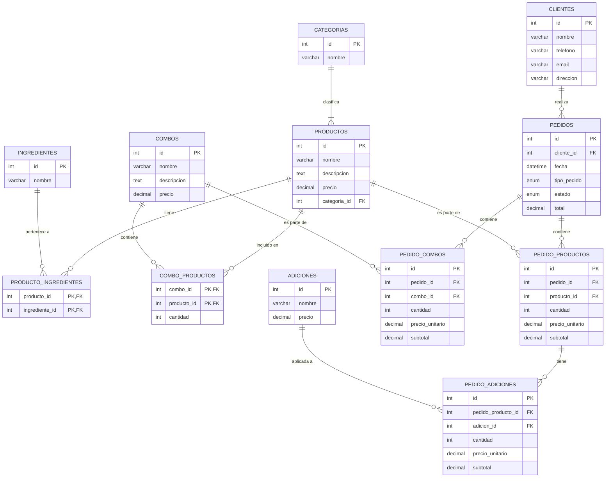

# Sistema de Gestión de Base de Datos para Pizzería

Este proyecto contiene el diseño e implementación de una base de datos relacional para gestionar las operaciones de una pizzería, cumpliendo con los requerimientos de manejo de productos, ingredientes, adiciones, combos, clientes y pedidos.

## Archivos del Proyecto

*   **`estructura.sql`**: Contiene los comandos DDL (`CREATE TABLE`) para construir la estructura de la base de datos, definiendo claves primarias y foráneas.
*   **`datos.sql`**: Contiene los comandos DML (`INSERT INTO`) para poblar las tablas con datos de prueba realistas que permiten probar el sistema.
*   **`README.md`**: Este archivo con la documentación del proyecto, diagrama de base de datos y consultas SQL resueltas.

## Instrucciones de Ejecución

Para implementar esta base de datos en tu entorno MySQL:

1.  Abre tu cliente de MySQL (ej. MySQL Workbench, phpMyAdmin, o línea de comandos).
2.  Carga y ejecuta primero el script **`estructura.sql`**. Esto creará la base de datos `pizzeria_db` y todas sus tablas con las relaciones correspondientes.
3.  Carga y ejecuta el script **`datos.sql`**. Esto insertará datos de prueba en la base de datos, lo cual es necesario para que las consultas arrojen resultados.

## Diagrama Entidad-Relación (ERD)

A continuación se muestra el modelo lógico y físico de la base de datos diseñado para la pizzería:



## Solución a Consultas SQL

Como parte de los requerimientos, aquí se presentan algunas consultas útiles que demuestran el funcionamiento del sistema:

### 1. Consultar todos los productos junto con su categoría
**Lógica:** Usamos un `INNER JOIN` entre `productos` y `categorias` para mostrar el nombre legible de la categoría en lugar de solo su ID.
```sql
SELECT p.nombre AS Producto, p.precio, c.nombre AS Categoria
FROM productos p
INNER JOIN categorias c ON p.categoria_id = c.id
ORDER BY c.nombre, p.nombre;
```

### 2. Ver los ingredientes de una pizza específica (ej: Pizza Hawaiana)
**Lógica:** Se requieren uniones (`JOIN`) entre la tabla `productos`, la tabla intermedia `producto_ingredientes` y la tabla `ingredientes` para listar los componentes del producto.
```sql
SELECT p.nombre AS Producto, i.nombre AS Ingrediente
FROM productos p
INNER JOIN producto_ingredientes pi ON p.id = pi.producto_id
INNER JOIN ingredientes i ON pi.ingrediente_id = i.id
WHERE p.nombre = 'Pizza Hawaiana Mediana';
```

### 3. Calcular el total de ingresos por tipo de pedido (En sitio vs Recoger)
**Lógica:** Se utiliza la función de agregación `SUM()` agrupando por la columna `tipo_pedido` de la tabla `pedidos`. Solo se consideran los pedidos entregados.
```sql
SELECT tipo_pedido, SUM(total) AS Ingresos_Totales
FROM pedidos
WHERE estado = 'Entregado' OR estado = 'Listo'
GROUP BY tipo_pedido;
```

### 4. Consultar el detalle completo de un pedido con sus adiciones (ej: Pedido 1)
**Lógica:** Unimos las tablas `pedidos`, `pedido_productos`, `productos`, y usamos un `LEFT JOIN` con `pedido_adiciones` y `adiciones` en caso de que un producto en el pedido no tenga adiciones.
```sql
SELECT 
    pd.id AS Numero_Pedido, 
    pr.nombre AS Producto, 
    pp.cantidad AS Cant_Producto, 
    a.nombre AS Adicion, 
    pa.cantidad AS Cant_Adicion
FROM pedidos pd
INNER JOIN pedido_productos pp ON pd.id = pp.pedido_id
INNER JOIN productos pr ON pp.producto_id = pr.id
LEFT JOIN pedido_adiciones pa ON pp.id = pa.pedido_producto_id
LEFT JOIN adiciones a ON pa.adicion_id = a.id
WHERE pd.id = 1;
```
